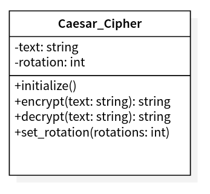

# Caesar Cipher
> This project is a simple Caesar Cipher made in Ruby using TDD.

## 🔧 Built With
- Ruby
- RSpec
- GitFlow Workflow

## Project requirements
- Only works with letters between a/A and z/Z. And the symbols: '?' and '!' (Discard everything else)
-	Accepts some text to encrypt and a number which defines the "shift factor"
- "Shifts" the letters by X positions using the order of the alphabet (ABCDF)
- Restrictions:
  - Return from z to a
	- Return the same case of the letter

## UML Classes



## 🔴 Live Demo

## 🛠  Getting Startd
### Prerequisites
### Setup
### Install
Add this line to your application's Gemfile:

```ruby
gem 'caesar_cipher'
```

And then execute:

    $ bundle install

Or install it yourself as:

    $ gem install caesar_cipher

### Usage
### Development & Tests
After checking out the repo, run `bin/setup` to install dependencies. Then, run `rake spec` to run the tests. You can also run `bin/console` for an interactive prompt that will allow you to experiment.

To install this gem onto your local machine, run `bundle exec rake install`. To release a new version, update the version number in `version.rb`, and then run `bundle exec rake release`, which will create a git tag for the version, push git commits and tags, and push the `.gem` file to [rubygems.org](https://rubygems.org).

### Deployment

## Authors
👤 **Marcos Hernández Campos**
- Github: [@marcoshdezcam](https://github.com/marcoshdezcam)
- Twitter: [@MarcosHCampos](https://twitter.com/MarcosHCampos)
- Linkedin: [Marcos Hernández](https://linkedin.com/marcos-hernández-56058119a/)

## 🤝 Contributing

Contributions, issues and feature requests are welcome!

Feel free to check the [issues page](issues/).

## Show your support

Give a ⭐️ if you like this project!

## Acknowledgments

- Hat tip to anyone whose code was used
- Inspiration
- etc

## 📝 License

The gem is available as open source under the terms of the [MIT License](https://opensource.org/licenses/MIT).

## Code of Conduct

Everyone interacting in the CaesarCipher project's codebases, issue trackers, chat rooms and mailing lists is expected to follow the [code of conduct](https://github.com/[USERNAME]/caesar_cipher/blob/master/CODE_OF_CONDUCT.md).
