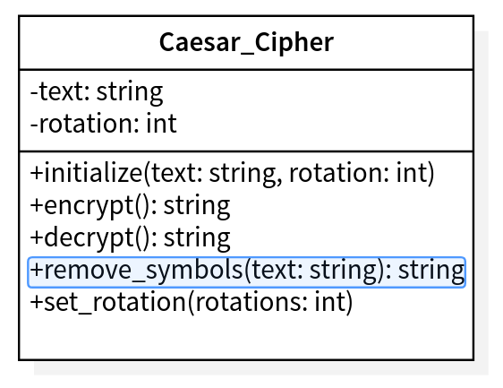

# Caesar Cipher
> This project is a simple Caesar Cipher made in Ruby using TDD.

## 🔧 Built With
- Ruby
- RSpec
- GitFlow Workflow

## Project requirements
- Only works with letters between a/A and z/Z. (Discard everything else)
-	Accepts some text to encrypt and a number which defines the "shift factor"
- "Shifts" the letters by X positions using the order of the alphabet (ABCDF)
- Restrictions:
  - Return from z to a
	- Return the same case of the letter

## UML Classes

## 🔴 Live Demo

## 🛠 Getting Started 
### Prerequisites
### Setup
### Install
### Usage
### Run tests
### Deployment

## ✒️ Author
👤 **Marcos Hernández Campos**
- Github: [@marcoshdezcam](https://github.com/marcoshdezcam)
- Twitter: [@MarcosHCampos](https://twitter.com/MarcosHCampos)
- Linkedin: [Marcos Hernández](https://linkedin.com/marcos-hernández-56058119a/)

## 🤝 Contributing

Contributions, issues and feature requests are welcome!

Feel free to check the [issues page](issues/).

## Show your support

Give a ⭐️ if you like this project!

## Acknowledgments

- Hat tip to anyone whose code was used
- Inspiration
- etc

## 📝 License

This project is [MIT](lic.url) licensed.
